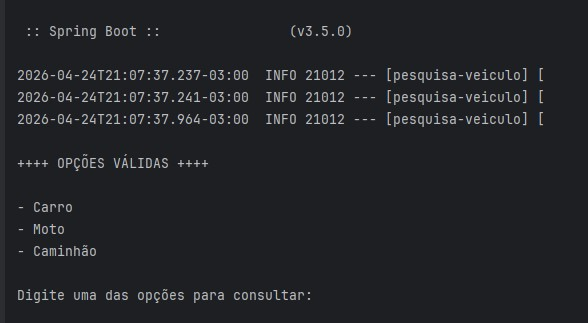
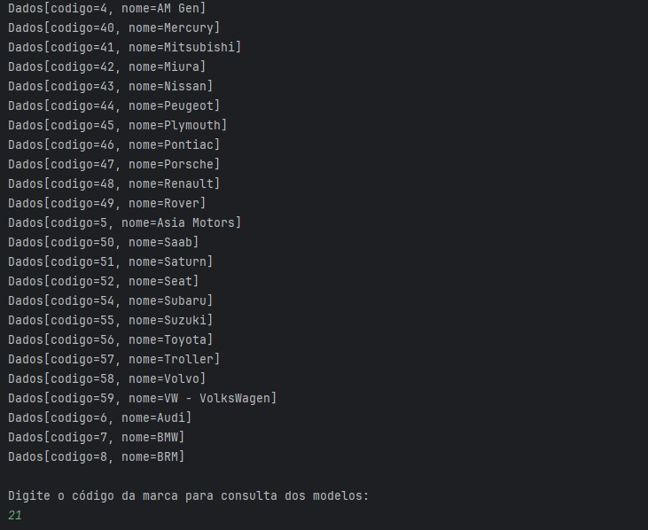
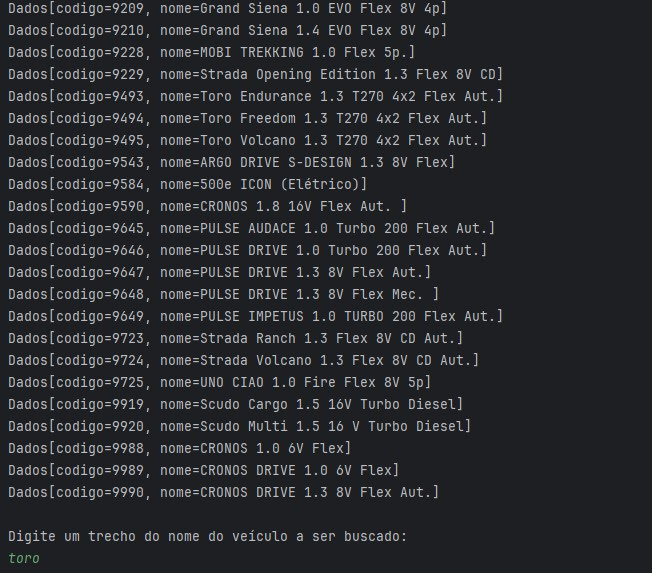
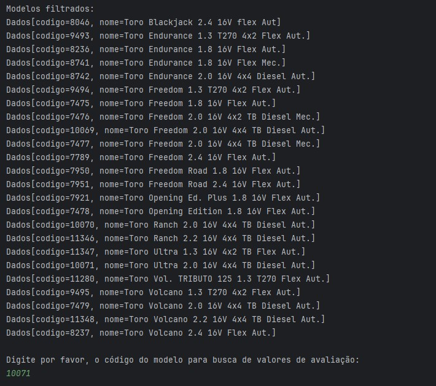
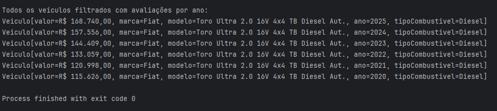

# Consulta Tabela FIPE 


[](https://parallelum.com.br/fipe/)


## Sobre o projeto

Aplicação Java para consulta de veículos utilizando a API da Tabela FIPE.  
O sistema permite navegar por categorias, marcas, modelos e anos, retornando informações detalhadas como valor, combustível e ano do veículo.
A aplicação guia o usuário por um fluxo de consultas até chegar ao valor atualizado de um veículo específico, com base nos dados da Tabela FIPE.

Obs: Este projeto foi desenvolvidopara fins de estudo com o objetivo de praticar consumo de APIs, manipulação de dados e interação com o usuário via terminal.

---

## Funcionalidades

A aplicação funciona via terminal com um fluxo interativo:

1. O usuário escolhe o tipo de veículo:
   - Carro
   - Moto
   - Caminhão

2. O sistema retorna **todas as marcas disponíveis** para o tipo escolhido.

3. O usuário informa o **código da marca desejada**.

4. Em seguida, pode digitar parte do nome do veículo (ex: `toro`).

5. O sistema retorna **todos os modelos relacionados à busca**.

6. O usuário escolhe o **código do modelo específico**.

7. Por fim, são exibidas informações como:
   - Valor
   - Marca
   - Modelo
   - Ano
   - Tipo de combustível 

---
## Tecnologias utilizadas

- Java
- Apache Maven
- HttpClient (Java 11+)
- API REST (consumo externo)

## API utilizada

Esse projeto utiliza uma API pública baseada na tabela FIPE.<br>
```bash
https://parallelum.com.br/fipe/api/v1/
```

 ⚠️ Esta API não é oficial do governo. Ela é mantida por terceiros e utilizada aqui apenas para fins educacionais. <br>
 ⚠️ Como a mesma é pública e não oficial, pode haver instabilidades, os dados dependem da disponibilidade da API externa.


## Como executar o projeto

1. Clone o repositório:
```bash
git clone https://github.com/Kathlynleticia/consulta-tabela-FIPE.git
```
2. Abra o projeto na sua IDE (IntelliJ, Eclipse, etc.)
3. Execute a classe principal
4. Interaja com o menu pelo terminal


## Demonstração - Execução do Sistema
<br>

<br>
<br>
<br>
<br>
<br>
<br>
<br>
<br>


---

## Aprendizados

Este projeto ajudou a praticar:

- Consumo de APIs REST em Java
- Manipulação de JSON
- Organização de código
- Entrada e validação de dados
- Filtragem de informações

## Possíveis melhorias

- Criar interface gráfica (GUI) ou versão web
- Implementar cache
- Melhorar validações
- Adicionar tratamento de erros mais robusto
- Criar testes automatizados
  
---

### 🙋🏻 Autora

Projeto desenvolvido por Kathlyn Leticia, como parte dos estudos iniciais em Java!
